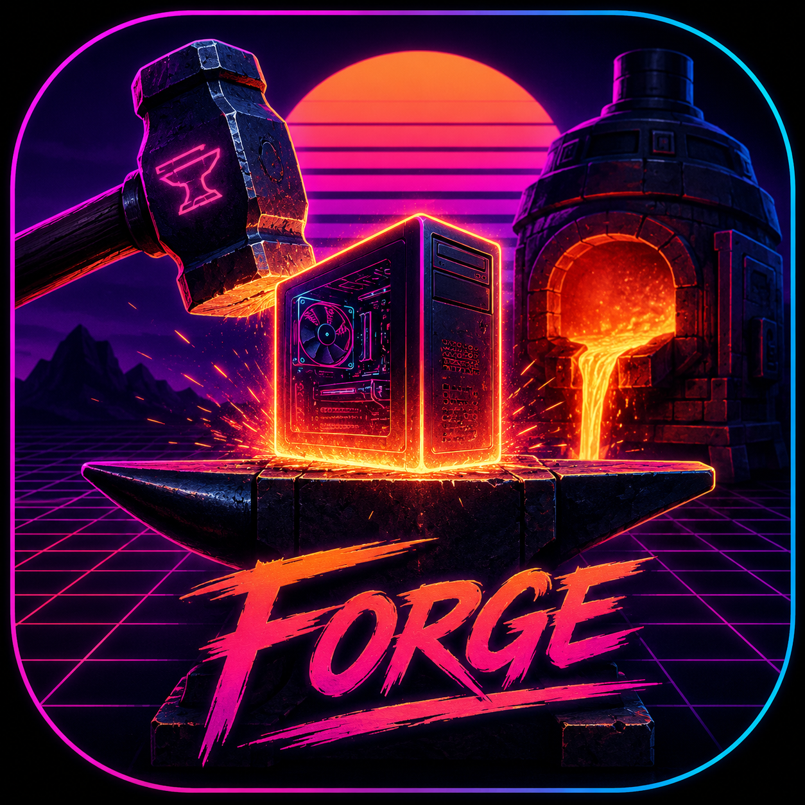

<picture>
  <source media="(prefers-color-scheme: dark)" srcset="assets/forge-icon.png">
  
</picture>

# Forge

**Craft Your Digital Future.**

The blacksmith was the cornerstone of every civilization. They built the tools that built everything else. The sword, the plow, the cathedral — all born at the forge.

Forge is that for the digital age.

A CLI platform and web dashboard where human creativity meets artificial intelligence. Where you don't just store code — you craft your entire digital life. Git backups. AI orchestration. Scripture. System management. Creative tools. L-system fractals. Reading plans. All connected. All local. All yours.

**One forge to shape them.**

---

## 📦 What's Inside

| Component | Description | Language | Status |
|-----------|-------------|----------|--------|
| **Forge CLI** | Terminal workshop — 23+ commands across 6 pillars | Rust | ✅ v1.4.0 |
| **Forge Hub** | Visual command center — synthwave84 web GUI | Ruby on Rails 8 | ✅ v1.4.0 |

```
forge/
├── src/              → Forge CLI (Rust binary, 14 modules, ~9,000 lines)
├── hub/              → Forge Hub (Rails 8 web app, 7 pillar pages, 230+ specs)
├── assets/           → App icon, branding
├── Cargo.toml        → CLI build config
└── hub/Gemfile       → Hub dependencies
```

---

## 🔨 Forge CLI

The terminal workshop. Everything starts here.

### The Six Pillars

| Pillar | Command | Purpose | Status |
|--------|---------|---------|--------|
| **Anvil** | `forge anvil` | Backup & restore management, diff, health, prune | ✅ Done |
| **Bellows** | `forge breathe` | AI agent orchestration, pipelines, sessions | ✅ Done |
| **Flame** | `forge word` | Scripture, reading plans, prayer journal | ✅ Done |
| **Tongs** | `forge grip` | System management, dotfiles, hooks, diagnostics | ✅ Done |
| **Crucible** | `forge melt` | Creative tools — fractals, chords, palettes, diagrams | ✅ Done |
| **Bridge** | `forge bridge` | Integrations, webhooks, notifications, sync | ✅ Done |

### Install from Release

```bash
curl -sL https://github.com/synthalorian/forge/releases/latest/download/forge -o ~/.local/bin/forge
chmod +x ~/.local/bin/forge
forge init
```

**Or build from source:** Rust 1.75+, Git, C compiler

```bash
git clone https://github.com/synthalorian/forge.git
cd forge
cargo install --path .
```

### Quick Start

```bash
# Initialize
forge init

# Backup a project
forge quench /path/to/project

# See your backups
forge list

# Set the theme
forge theme set synthwave84

# Today's verse
forge word

# AI agent status
forge breathe
```

### Full Command Reference

```
forge                              Dashboard — what's happening right now
forge init                         First-time setup
forge status                       System & backup health overview

# Workshop Verbs
forge quench [path]                Backup git repos
forge restore <id>                 Restore from backup
forge heat                         Spin up AI agents
forge strike <task>                Execute task via best available agent
forge temper                       Verify backup integrity
forge anneal                       Enter deep work mode (do not disturb)
forge alloy <sources>              Merge outputs from multiple agents
forge cast                         Build release binary + create GitHub release
forge grind                        Run linters, tests, quality checks
forge polish                       Format and document

# Anvil — Backup Management
forge anvil search <query>         Search across all backed-up repos
forge anvil health                 Project health dashboard
forge anvil prune                  Enforce retention policy
forge anvil diff <id1> <id2>       Compare file lists between two backups

# Bellows — AI Agents
forge breathe                      Agent status dashboard
forge breathe models               List available local models
forge breathe sessions             Manage agent conversation sessions
forge breathe pipe <file>          Run multi-step agent pipeline (TOML)
forge strike <task>                Execute via best available agent

# Flame — Scripture & Spirit
forge word                         Daily scripture verse
forge word search <query>          Search the Bible (KJV bundled offline)
forge word reference John 3:16     Look up a passage
forge word plan                    Reading plans (psalms-30, gospels-40, etc.)
forge word plan --activate <name>  Start a reading plan
forge word plan --progress         Track your progress
forge reflect entry "Today I..."   Write prayer journal entry (AES-256-GCM)
forge reflect history              Browse journal entries
forge rest                         Sabbath mode — shut it all down

# Tongs — System Management
forge grip                         System dashboard (CPU, memory, disk, GPU)
forge grip diagnose                Full system health check
forge grip dotfiles track <path>   Version your dotfiles
forge grip hooks install           Auto-backup on every git commit
forge grip hooks list              View installed git hooks

# Crucible — Creative Tools
forge melt chords [key]            Chord progressions and music theory
forge melt palette <color>         Color palette generation
forge melt palette --file img.png  Extract palette from an image
forge melt diagram flow            ASCII architecture diagrams
forge melt fractal koch            L-system fractals (Koch, Dragon, Sierpinski...)
forge melt markdown <file>         Terminal markdown renderer
forge melt image <prompt>          Procedural abstract image generation

# Bridge — Integrations
forge bridge                       Connection status dashboard
forge bridge hooks                 List webhook endpoints
forge bridge sync                  Sync task state across platforms
forge bridge notify                Send test notification

# Personalization
forge theme list                   Browse 12 built-in themes
forge theme preview <name>         See a theme in action
forge theme set <name>             Apply a theme
forge theme create                 Build your own theme (interactive TOML builder)
forge theme export <name>          Export theme to Alacritty/Kitty/Ghostty config
forge theme export <name> -w       Write theme directly to terminal config file
```

### Reading Plans

Four guided scripture reading plans, all offline (KJV bundled):

| Plan | Duration | Description |
|------|----------|-------------|
| `psalms-30` | 30 days | 5 psalms per day through all 150 |
| `proverbs-month` | 31 days | Chapter matching the day of the month |
| `gospels-40` | 40 days | Through Matthew, Mark, Luke & John |
| `new-testament-90` | 90 days | Entire New Testament |

```bash
# Start a plan
forge word plan --activate psalms-30

# Today's reading
forge word plan

# Check progress
forge word plan --progress
```

### L-System Fractals

Seven presets with custom rule support. `forge melt fractal` generates ASCII art or SVG output:

| Preset | Description |
|--------|-------------|
| `koch` | Koch snowflake curve |
| `dragon` | Dragon curve (Jurassic Park fractal) |
| `sierpinski` | Sierpinski triangle |
| `plant` | Branching plant structure |
| `hilbert` | Hilbert space-filling curve |
| `gosper` | Gosper curve / flowsnake |
| `weed` | Randomized weed growth |

```bash
# Generate a dragon curve
forge melt fractal dragon

# Custom L-system
forge melt fractal --axiom F --rule "F→F+F-F-F+F" --iterations 5 --angle 90

# SVG output
forge melt fractal plant --output svg
```

### Agent Pipelines

Multi-step AI agent pipelines defined as TOML files:

```toml
name = "Code Review"
description = "Review a PR and summarize"

[[steps]]
name = "review_diff"
task = "Review this PR diff for bugs and style issues"
agent = "opencode"
input_keys = "pr_diff"

[[steps]]
name = "summarize"
task = "Summarize the changes for the team"
agent = "auto"
```

```bash
forge breathe pipe review-pipeline.toml
```

**Visual pipeline builder also available in Forge Hub** — drag-free step cards with presets for Code Review, Research & Write, Code Gen & Test, and Data Pipeline.

### Build & Release Automation

```bash
# Build release binary, create GitHub release, upload assets
forge cast

# Or manually
cargo build --release
gh release create v1.4.0 target/release/forge --title "v1.4.0" --repo synthalorian/forge
```

`forge cast` handles the full release workflow: detects your git repo and version, builds the binary, creates a GitHub release with auto-generated notes, and uploads the hub tarball and app icon.

### Git Hooks

Automatically backup on every commit:

```bash
# Install a post-commit hook
cd /path/to/your/project
forge grip hooks install

# Now every git commit runs forge quench automatically
```

### Built-in Themes

12 themes, each with 12 color slots. Built for terminals that speak true color.

| Theme | Description |
|-------|-------------|
| `synthwave84` | Neon purple on deep black — the default 🔮 |
| `synthwave-night` | Magenta and cyan in darkness |
| `synthwave-sunset` | Pink and orange horizon |
| `neon-city` | Electric blue and hot pink |
| `dark` | Clean monochrome for the purist |
| `light` | Bright and readable |
| `ocean` | Deep blues and seafoam |
| `forest` | Greens and earth tones |
| `sunset` | Warm oranges and purples |
| `midnight` | Dark navy with silver accents |
| `retro` | Amber phosphor CRT green |
| `dracula` | Purple and green classic |

Create your own with `forge theme create` — it's just a TOML file with 12 hex colors. Export to your terminal with `forge theme export synthwave84 -w`.

### Architecture

```
~/.forge/
├── config.toml            Your forge configuration
├── vault/                 Encrypted credentials (AES-256-GCM)
├── db/
│   ├── forge.db           Core metadata (backups, projects, schedules)
│   ├── spirit.db          Journal entries, reading plans, bookmarks
│   └── agents.db          AI agent state, sessions, history
├── archives/              Git backups (zstd compressed, content-deduplicated)
├── chunks/                Deduplicated content store (SHA-256 sharded)
├── projects/              Project registry and metadata
├── prompts/               Versioned prompt library
├── themes/                Custom themes (TOML)
├── scripts/               Automation hooks and lifecycle events
└── logs/                  Activity history and audit trail
```

### Archive Format

Each backup produces a `.tar.zst` file containing a bare git clone of the repository. Archives are named `<repo>-<timestamp>.tar.zst`. Metadata (branches, tags, commit count, SHA-256 hash, chunk references) is stored in SQLite for instant querying.

### Content Deduplication

The ChunkStore splits data into 4MB blocks, SHA-256 hashes each one, compresses with zstd, and stores them in a sharded content-addressable layout (`chunks/ab/cdef...zst`). New backups only store chunks they haven't seen before. Across all your projects, identical dependencies, assets, and boilerplate are stored once.

### Backup Diff

Compare two backups to see what changed:

```bash
# Compare backup #42 with its previous backup
forge anvil diff 42

# Compare two specific backups
forge anvil diff 15 42

# Shows:
#   + added files (green)  
#   - removed files (red)
#   ~ changed files with size delta (yellow)
```

---

## 🖥️ Forge Hub

The visual command center. A Rails 8 web GUI that sits on top of Forge CLI, giving you a synthwave-styled dashboard for your forge infrastructure.

### Features

- **Dashboard** — At-a-glance stats: backup count, repo count, storage used, active schedules, most-backed-up repos
- **Backup Browser** — Browse all backups with search, pagination, restore, and chart data
- **Archive Browser** — Browse backup contents with expandable file tree (size, permissions, paths)
- **Schedule Manager** — Create, toggle, and delete backup schedules with cron expressions
- **Flame** — Scripture search (debounced live search), reference lookup, encrypted journal browser with pagination
- **Bellows** — Agent detection, session management, quick strike, visual pipeline builder with 4 presets
- **Pipeline Builder** — Visual step cards with drag-free reorder, add/remove, presets, TOML serialization
- **Tongs** — System dashboard with GPU/temperatures/resource bars, diagnostics, dotfiles tracker, services list
- **Crucible** — Creative tools bridge (chords, palettes, diagrams, markdown, image generation, drag-and-drop palette extraction from images, L-system fractals)
- **Bridge** — Integration status for 11+ tools, lifecycle hooks, sync dashboard, notification testing, Omarchy detection
- **Live Backup Progress** — Real-time streaming output via Action Cable during backup operations
- **Synthwave84 Theme** — Deep purple palette with neon accents, CRT scanlines, horizon glow, glass morphism
- **Theme Switcher** — Toggle between Synthwave84, Midnight, Ocean, and Light variants
- **Global Search** — Search across all pillars (backups, schedules, scripture, sessions, dotfiles) from a unified search bar
- **Mobile Responsive** — Sidebar collapses to overlay on phones, grids stack vertically, all pages functional on small screens

### Install & Run

**Prerequisites:** Ruby 3.2+, Bundler, Rails 8.1+, Forge CLI installed and initialized

```bash
# From the repo root
cd hub

# Install dependencies
bundle install

# Set up the database
bin/rails db:create db:migrate

# Build Tailwind CSS
bin/rails tailwindcss:build

# Start the server
bin/rails server

# Open in browser
# → http://localhost:3000
```

### Hub Configuration

The Hub reads from the same `~/.forge/` directory as the CLI. No separate configuration needed — it shares the SQLite databases, archive store, and theme settings.

### Development

```bash
# Run with hot-reload (Tailwind + Stimulus)
bin/dev

# Run tests (230+ specs)
bin/rails test

# Rebuild Tailwind after theme changes
bin/rails tailwindcss:build
```

### Tech Stack

| Layer | Technology |
|-------|------------|
| Framework | Ruby on Rails 8.1 |
| Frontend | Tailwind CSS v4 + Stimulus.js (no React) |
| Database | SQLite (shared with CLI) |
| Asset Pipeline | Propshaft |
| Web Server | Puma |
| Real-time | Action Cable |
| Theme | Synthwave84 (Omarchy-aligned purple palette) |

---

## ⚙️ Configuration

Default config at `~/.forge/config.toml`:

```toml
[forge]
name = "my-forge"
data_dir = "~/.forge"

[archive]
compression = 3
chunk_size = 4194304          # 4MB

[retention]
keep_daily = 7
keep_weekly = 4
keep_monthly = 12

[theme]
active = "synthwave84"

[agents]
auto_start = false
preferred = "opencode"
local_model = "llama-swap"

[spirit]
translation = "ESV"
daily_verse = true
sabbath_mode = false
journal_encrypted = true

[bridge]
notifications = ["desktop"]
webhooks = []
```

---

## 🚀 Releases

Each release ships with three assets attached:

| Asset | Description | Size |
|-------|-------------|------|
| `forge` (or `forge-vX.Y.Z`) | Linux x86_64 binary, statically linked | ~7MB |
| `forge-hub.tar.gz` | Rails app bundle (hub/ directory) | ~120KB |
| `forge-icon.png` | Synthwave blacksmith app icon (1254×1254) | ~2.2MB |

Download from the [Releases page](https://github.com/synthalorian/forge/releases).

### Changelog

| Version | Date | Highlights |
|---------|------|------------|
| v1.4.0 | May 2026 | Visual pipeline builder, mobile responsive Hub |
| v1.3.0 | May 2026 | Image upload palette, forge cast, backup diff, reading plans |
| v1.2.0 | May 2026 | L-system fractals, theme export --write, git hooks, archive browser, Action Cable, tests |
| v1.1.0 | May 2026 | Hub polish: per-tab crucible, Stimulus dotfile tracker, feature parity |
| v1.0.0 | May 2026 | Production release: all 6 pillars, 23 CLI commands, full Hub, security hardened |

---

## 🗺️ What's Built

### Phase 1 — Foundation ✅

| Module | Status |
|--------|--------|
| CLI framework (clap) | ✅ |
| Configuration (TOML + XDG) | ✅ |
| Data models & errors | ✅ |
| SQLite database | ✅ |
| Backup engine (bare git clone, streaming tar) | ✅ |
| Archive storage (zstd compression) | ✅ |
| Restore engine (extract, ref checkout, dry-run) | ✅ |
| Content deduplication (ChunkStore, SHA-256) | ✅ |
| Theme engine (12 themes × 12 colors) | ✅ |
| Cron scheduler | ✅ |
| Forge Hub — Rails 8 web GUI | ✅ |

### Phase 2 — Expansion ✅

| Module | Status |
|--------|--------|
| Scripture search & reference | ✅ |
| Encrypted prayer journal | ✅ |
| Sabbath mode | ✅ |
| AI agent harness (`forge breathe`) | ✅ |
| Multi-agent orchestration (`forge strike`) | ✅ |
| Agent pipeline system (`forge breathe pipe`) | ✅ |
| Session persistence with CRUD | ✅ |
| Credential vault | ✅ |
| Prompt library | ✅ |
| System diagnostics | ✅ |
| Git hook installer (`forge grip hooks`) | ✅ |
| Hub — real-time backup progress (Action Cable) | ✅ |
| Hub — agent status dashboard | ✅ |

### Phase 3 — Creative & Integration ✅

| Module | Status |
|--------|--------|
| L-system fractal generator (7 presets) | ✅ |
| Chord progressions & music theory | ✅ |
| Color palette generation + image extraction | ✅ |
| ASCII/SVG architecture diagrams | ✅ |
| Terminal markdown renderer | ✅ |
| Procedural image generation | ✅ |
| Backup diff / changelog | ✅ |
| Notification hub | ✅ |
| Webhook management | ✅ |
| Bridge sync | ✅ |
| Reading plans (psalms, gospels, proverbs, NT) | ✅ |
| Theme export to Alacritty/Kitty/Ghostty | ✅ |
| GitHub release automation (`forge cast`) | ✅ |
| Hub — full pillar pages (all 6) | ✅ |
| Hub — archive browser with file tree | ✅ |
| Hub — journal browser with pagination | ✅ |
| Hub — session detail with message history | ✅ |
| Hub — dotfiles management | ✅ |
| Hub — global search | ✅ |
| Hub — visual pipeline builder | ✅ |
| Hub — mobile responsive | ✅ |

---

## Technical Decisions

1. **Everything is local first.** No cloud required. Network is optional enhancement.
2. **SQLite for all state.** No external databases. No daemons. Just files.
3. **Streaming pipelines.** No temp files. Pipe everything.
4. **Content-addressable storage.** Dedup at the chunk level across all projects.
5. **Bridge, don't compete.** Forge integrates with Hermes, Omarchy, llama-swap — it doesn't replace them.
6. **Encryption for private data.** Prayer journal, credentials — AES-256-GCM, local keys.
7. **Offline capable.** Entire KJV Bible bundled. Backups local. Agents optional.
8. **One repo, two surfaces.** CLI for speed. Hub for visibility. Same data, same forge.
9. **116 tests.** Unit + integration + spirit + 230 Hub specs, all green.

---

## The Creed

```
Forge is not a backup tool that grew too big.
Forge is a workshop that started with a solid anvil.

Every feature earns its place.
Every command maps to a concept you can remember.
Every pillar serves the smith, not the other way around.

The forge doesn't phone home.
The forge doesn't require the cloud.
The forge doesn't compete with its neighbors — it bridges to them.

We build in the open. We ship what works. We rest when it's time to rest.

"As iron sharpens iron, so one person sharpens another." — Proverbs 27:17
"For we are God's handiwork — His poem — created for good works." — Ephesians 2:10

Heat the coals. Strike the iron. Forge your future. 🔨
```

---

## The Vision

> *Genesis 4:22 — "Tubal-cain, who forged all kinds of tools out of bronze and iron."*

The first craftsman named in Scripture was a forger of tools. Not a king. Not a priest. A maker.

Forge exists because the terminal is the modern workshop, and the developer is the modern blacksmith. Every line of code is a hammer strike. Every git commit is a cooling blade. Every prayer is fuel for the fire.

We're building the tool that builds all other tools.

The forge doesn't ask permission. It doesn't wait for the cloud. It takes raw material — code, data, ideas, AI output, faith, creativity — and shapes it into something real. Something lasting. Something that outlives the smith.

> *"For we are God's handiwork, created in Christ Jesus to do good works, which God prepared in advance for us to do."* — Ephesians 2:10

The Greek word for "handiwork" is *poiēma*. It's where we get "poem."

You are a poem being written. Write good code. Do good works. Forge your future.

**This is the workshop. You are the smith.**

---

## Testing

```bash
# Run all Rust tests (116 total)
cargo test

# Run Hub specs (230+)
cd hub && bundle exec rspec

# CI runs both on every push
```

Test coverage: 91 unit tests + 17 integration tests + 8 spirit tests + 230 Hub specs.

---

## Contributing

See [CONTRIBUTING.md](CONTRIBUTING.md) for guidelines. PRs welcome — every smith needs apprentices.

## License

Licensed under [Apache License 2.0](LICENSE).

---

## Credits

Developed by **synth** ([synthalorian](https://github.com/synthalorian)) with assistance from **synthshark** 🎹🦈 — a digital entity from the neon grid of 1984.

---

*"The grid remembers everything. So should you."* 🎹🦈
